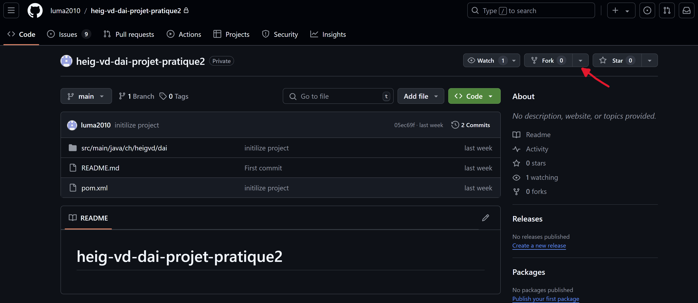
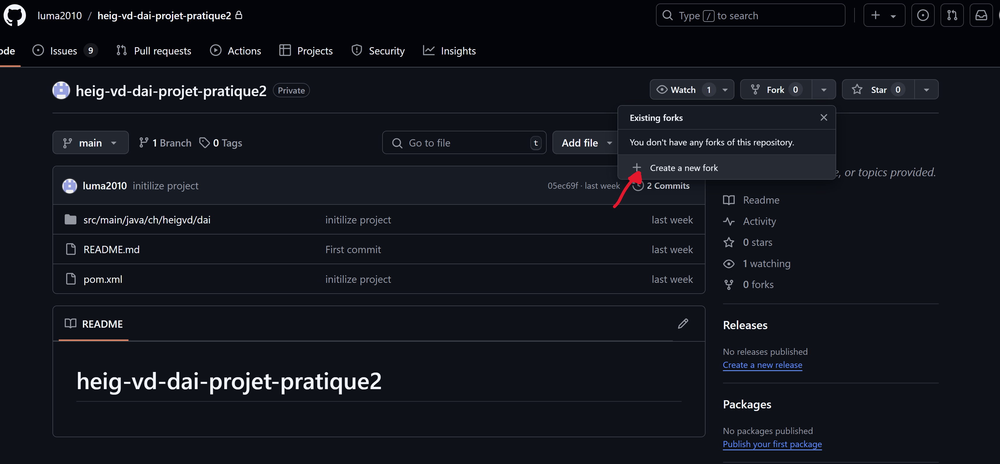

# heig-vd-dai-projet-pratique2
#### Chollet Florian - Delétraz Alexandre


# VAMP Protocole :

## Section 1 - Overview
Le protocole VAMP (Variables Modification Protocole) est un protocole qui permet la modification de variables dans un
fichier existant.
Les modifications possibles sont :
- Ajout d'une variable dans un fichier.
- Suppression d'une variable dans un fichier.
- Modification de la valeur d'une variable dans un fichier.
- Renommer une variable d'un fichier.
- Ajouter un fichier.
- Supprimer un fichier.
- Renommer un fichier.

## Section 2 - Transport Protocole
Le protocole VAMP utilise TCP afin de vérifier que la réception et l'envoie de données a bien été effectué, il sera 
utilisé sur le port 4444.

Tous les messages sont encodé en UTF-8 et sont délimité par un retour à la ligne ("\n").

Le démarrage de la connection sera effectué par le client. 
Une fois la connection établie, le client sera inviter à rentrer une commande à effectuer parmi une liste de commandes.

Si le client envoie une commande inexistante, le serveur retournera une erreur. 
Dans le cas contraire, le serveur essayera d'effectuer la commande en question.

Si une erreur survient au milieu de la commande, une erreur sera retournée, et le client sera invité à reprendre une 
commande disponible.

La fermeture de la connection sera effectuée en premier par le client, puis par le serveur.

## Section 3 - Messages

### Choix des commandes
Le client sera invité à utiliser une des commandes suivantes :
```text
LS 
CAT <filename>
VARIABLES <filename>
```

### LS :
La commande ```LS``` permet d'afficher les différents fichiers modifiables dans le serveur.

Reponse du serveur :
```text
FILES <filename1> <filename2> ...
```

### CAT :
La commande ```CAT``` permet d'afficher le contenu d'un fichier.

Requete :
```text
CAT <filename>
```
```<filename>``` : nom du fichier

Reponse :

Si le fichier existe et qu'il n'y a pas d'erreur, la réponse serveur sera :
```text
variable1=value1
variable2=value2
...
```
Dans le cas contraire, la réponse sera :
```text
ERROR <num>
```
```<num>``` :

- 1 : le fichier rechercher n'existe pas.
- 2 : le fichier est déja ouvert par un autre utilisateur.

### VARIABLES :
La commande ```VARIABLES``` permet de modifier, ajouter ou supprimer une variable contenue dans un fichier.

Requête :
```text
VARIABLES <filename>
```
Si une erreur survient, le message suivant sera afficher :
```text
ERROR <num>
```
```<num>``` :

- 1 : le fichier rechercher n'existe pas.
- 2 : le fichier est déja ouvert par un autre utilisateur.

Dans le cas contraire, l'utilisateur sera présenter avec les options suivantes :

```text
ADD <varName> <varValue>
DELETE <varName>
MODIFY <varName> <varValue>
RENAME <varName> <newVarName>
```

#### ADD :
La commande ```ADD``` permet d'ajouter une variable dans un fichier.

Requête :
```text
ADD <varName> <varValue>
```
- ```<varName>``` : nom de la variable
- ```<varValue>``` : valeur de la variable.

Réponse :
- ```OK``` : la creation de la variable n'a eu aucun problème
- ```ERROR <num>``` : la création de la variable a entrainé une des erreurs suivantes :
  - 1 : une variable existe déja avec le nom demandé.
  - 2 : un ou plusieurs arguments sont manquants.

#### DELETE :
La commande ```DELETE``` permet de supprimer une variable dans un fichier.

Requête : 
```text
DELETE <varName>
```
- ```<varName>``` : nom de la variable

Réponse :
- ```OK``` : la suppression de la variable n'a eu aucun problème
- ```ERROR <num>``` : la suppression de la variable a entrainé une des erreurs suivantes :
  - 1 : aucune variable avec le nom suivant existe
  - 2 : un ou plusieurs arguments sont manquants.

#### MODIFY :
La commande ```MODIFY``` permet de modifier la valeur d'une variable.

Requête :
```text
MODIFY <varName> <varValue>
```
- ```<varName>``` : nom de la variable
- ```<varValue>``` : nouvelle valeur de la variable

Réponse :
- ```OK``` : la modification de la valeur de la variable n'a eu aucun problème
- ```ERROR <num>``` : la modification de la valeur de la variable a entrainé une des erreurs suivantes :
  - 1 : aucune variable avec le nom suivant existe.
  - 2 : un ou plusieurs arguments sont manquants.

#### RENAME :
La commande ```RENAME``` permet de modifier le nom d'une variable.

Requête :
```text
RENAME <varName> <newVarName>
```
- ```<varName>``` : nom de la variable
- ```<newVarName>``` : nouveau nom de la variable

Reponse : 
- ```OK``` : la modification du nom de la variable n'a eu aucun problème
- ```ERROR <num>``` : la modification du nom de la variable a entrainé une des erreurs suivantes :
  - 1 : aucune variable avec ce nom n'existe.
  - 2 : une variable avec ce nom existe déja.
  - 3 : un ou plusieurs arguments sont manquants.

## Section 4 - Examples


## Utiliser le projet localement
Afin d'utiliser le programme localement sur votre machine, rendez-vous sur notre repo GitHum en cliquant sur le lien 
suivant :  
[Lien du projet](https://github.com/luma2010/heig-vd-dai-projet-pratique2)

Une fois sur notre repository, nous vous recommandons de faire un fork du projet, cela vous permettra de tester ce que 
nous avons mis en place et d'y apporter des modifications comme bon vous semble.  
Pour faire le fork, il vous suffit de cliquer sur les boutons comme montré ci-dessous :





Une fois que vous avez le projet sur votre machine, vous devez lancer le serveur docker avec la commande suivante :
```text
docker run vamp_protocole
```

Le serveur docker tourne maintenant comme tâche en arrière-plan.

En parallèle, vous devez lancer l'application utilisateur, vamp_cli.

## Implémentation
// TODO  
- Explication de l'implémentation des fonctions et de l'application.
- Exemple d'affichage lors du démarrage.


