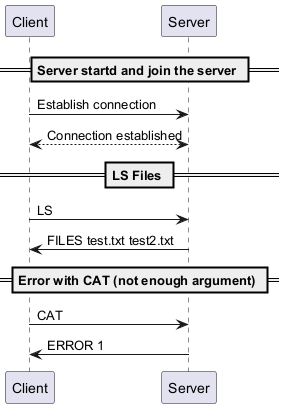
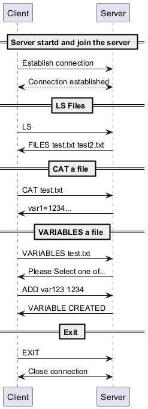

# heig-vd-dai-projet-pratique2
#### Chollet Florian - Delétraz Alexandre

# VAMP Protocole :

## Section 1 - Overview
Le protocole VAMP (Variables Modification Protocole) est un protocole qui permet la modification de variables dans un
fichier existant.
Les modifications possibles sont :
- Ajout d'une variable dans un fichier.
- Suppression d'une variable dans un fichier.
- Modification de la valeur d'une variable dans un fichier.
- Renommer une variable d'un fichier.
- Ajouter un fichier.
- Supprimer un fichier.
- Renommer un fichier.

## Section 2 - Transport Protocole
Le protocole VAMP utilise TCP afin de vérifier que la réception et l'envoie de données a bien été effectué, il sera 
utilisé sur le port 4444.

Tous les messages sont encodé en UTF-8 et sont délimité par un retour à la ligne ("\n").

Le démarrage de la connection sera effectué par le client. 
Une fois la connection établie, le client sera inviter à rentrer une commande à effectuer parmi une liste de commandes.

Si le client envoie une commande inexistante, le serveur retournera une erreur. 
Dans le cas contraire, le serveur essayera d'effectuer la commande en question.

Si une erreur survient au milieu de la commande, une erreur sera retournée, et le client sera invité à reprendre une 
commande disponible.

La fermeture de la connection sera effectuée en premier par le client, puis par le serveur.

## Section 3 - Messages
### Choix des commandes
Le client sera invité à utiliser une des commandes suivantes :
```text
LS 
CAT <filename>
VARIABLES <filename>
```

### LS :
La commande ```LS``` permet d'afficher les différents fichiers modifiables dans le serveur.

Reponse du serveur :
```text
FILES <filename1> <filename2> ...
```

### CAT :
La commande ```CAT``` permet d'afficher le contenu d'un fichier.

Requete :
```text
CAT <filename>
```
```<filename>``` : nom du fichier

Reponse :

Si le fichier existe et qu'il n'y a pas d'erreur, la réponse serveur sera :
```text
variable1=value1
variable2=value2
...
```
Dans le cas contraire, la réponse sera :
```text
ERROR <num>
```
```<num>``` :

- 1 : Il manque des arguments à la commande
- 2 : Le fichier souhaité n'existe pas

### VARIABLES :
La commande ```VARIABLES``` permet de modifier, ajouter ou supprimer une variable contenue dans un fichier.

Requête :
```text
VARIABLES <filename>
```
Si une erreur survient, le message suivant sera afficher :
```text
ERROR <num>
```
```<num>``` :

- 1 : le fichier rechercher n'existe pas.
- 2 : Il manque des arguments à la commande

Dans le cas contraire, l'utilisateur sera présenter avec les options suivantes :

```text
ADD <varName> <varValue>
DELETE <varName>
MODIFY <varName> <varValue>
RENAME <varName> <newVarName>
```

#### ADD :
La commande ```ADD``` permet d'ajouter une variable dans un fichier.

Requête :
```text
ADD <varName> <varValue>
```
- ```<varName>``` : nom de la variable
- ```<varValue>``` : valeur de la variable.

Réponse :
- ```VARIABLE CREATED``` : la creation de la variable n'a eu aucun problème
- ```ERROR <num>``` : la création de la variable a entrainé une des erreurs suivantes :
  - 1 : une variable existe déja avec le nom demandé.
  - 2 : un ou plusieurs arguments sont manquants.

#### DELETE :
La commande ```DELETE``` permet de supprimer une variable dans un fichier.

Requête : 
```text
DELETE <varName>
```
- ```<varName>``` : nom de la variable

Réponse :
- ```VARIABLE DELETED``` : la suppression de la variable n'a eu aucun problème
- ```ERROR <num>``` : la suppression de la variable a entrainé une des erreurs suivantes :
  - 1 : aucune variable avec le nom suivant existe
  - 2 : un ou plusieurs arguments sont manquants.

#### MODIFY :
La commande ```MODIFY``` permet de modifier la valeur d'une variable.

Requête :
```text
MODIFY <varName> <varValue>
```
- ```<varName>``` : nom de la variable
- ```<varValue>``` : nouvelle valeur de la variable

Réponse :
- ```VARIABLE MODIFIED``` : la modification de la valeur de la variable n'a eu aucun problème
- ```ERROR <num>``` : la modification de la valeur de la variable a entrainé une des erreurs suivantes :
  - 1 : aucune variable avec le nom suivant existe.
  - 2 : un ou plusieurs arguments sont manquants.

#### RENAME :
La commande ```RENAME``` permet de modifier le nom d'une variable.

Requête :
```text
RENAME <varName> <newVarName>
```
- ```<varName>``` : nom de la variable
- ```<newVarName>``` : nouveau nom de la variable

Reponse : 
- ```OK``` : la modification du nom de la variable n'a eu aucun problème
- ```ERROR <num>``` : la modification du nom de la variable a entrainé une des erreurs suivantes :
  - 1 : aucune variable avec ce nom n'existe.
  - 2 : une variable avec ce nom existe déja.
  - 3 : un ou plusieurs arguments sont manquants.

## Section 4 - Examples





## Utiliser le projet localement
Notre projet est mis sous la forme d'un conteneur Docker et il est stocké sur GitHub Container Registry.  
Afin d'utiliser le programme localement sur votre machine, il vous faudra utiliser la commande suivante :  

```bash
docker pull ghcr.io/luma2010/heig-vd-dai-rpjet-pratique2:latest
```

Afin que le projet puisse fonctionner, nous devons du créer un docker network afin que les deux containers puissent
communiquer entre eux. Il vous faudra télécharger ce conteneur en plus du projet.

Maintenant que vous avez les conteneurs sur votre machine, le premier conteneur que vous devez lancer est celui qui 
permet la connexion entre le client et le serveur. Voici la commande que nous vous recommandons de faire :
```bash
docker network create --subnet=172.28.0.0/16 mynet123
```

> [REMARQUE]  
> L'adresse IP peut être différente de celle que nous vous proposons, mais il faut utiliser le même range d'adresse
> afin de pouvoir établir la connexion.
 
Une fois que le docker network a été lancé, vous devez lancer le serveur docker avec la commande suivante :
```bash
docker run ghcr.io/luma2010/heig-vd-dai-rpjet-pratique2:latest <numero_port> server <adress_IP>
```

En parallèle, vous devez lancer la partie client avec la commande : 
```bash
docker run ghcr.io/luma2010/heig-vd-dai-rpjet-pratique2:latest <numero_port> client <adress_IP>
```
Une fois que la partie client est lancée, il vous suffit d'entrer les commandes que vous souhaitez utiliser.

## Publier le projet sur docker

## Implémentation
// TODO  
Dans cette section, nous allons passer plus en détail sur l'implémentation de nos méthodes.

La méthode _addVariableToFile_ :  
Pour cette méthode, nous avons choisi d'utiliser un _try-with-ressources_ dans lequel nous initialisons les flux d'entrée
et de sortie en spécifiant l'encodage souhaité (_UTF_8_).  
La fonction reçoit en paramètre le nom du fichier, le nom de la nouvelle variable et la nouvelle valeur. Elle permet 
ensuite lire le fichier courant et de stocker son contenu dans un _String_. Puis, elle va séparer en deux parties le nom
de la variable et sa valeur afin de vérifier que la variable que nous souhaitons ajouter n'est pas déjà présente dans 
le fichier. Si la variable n'existe pas, la fonction ajoute son nom et sa valeur dans le fichier.  
Une fois que l'écriture est faite, on _flush()_ et on sort de la méthode en retournant 0.  
Dans le cas où la variable existe déjà, nous retournons la valeur 1. Dans le cas ou le _try-with-ressources_ ne peut pas 
fonctionner, on retourne une exception.  
  
La méthode _deleteVariableToFile_ :  
Cette méthode reçoit en paramètre le nom du fichier et le nom de la variable à supprimer. La méthode utilise un 
_try-with-ressources_ dans lequel on initialise le flux d'entrée, le reader et le buffer de lecture. Nous spécifions 
l'encodage qui doit être en _UTF_8_.  
Dès le début de la fonction, une boucle _while_ va lire le fichier en séparant le nom des variables de leur valeur, tout
en permettant de comparer le nom des variables présentes avec celui de la variable à supprimer, afin de vérifier 
l'existence de la variable en question.  
Si la variable existe, nous passons un booléen à _true_ et nous sautons cette 
ligne, pour les autres lignes du fichier, elles sont stockée dans un _String_. Ensuite, nous faisons un nouveau 
_try-with-ressources_ dans lequel nous initialisons cette fois, un flux de sortie, un writer et un buffer d'écriture. 
Nous spécifions à nouveau que l'encodage doit être en _UTF_8_. Dans une boucle, nous réécrivons le fichier sans la 
variable que nous avons supprimée. Si la suppression se passe bien, un message indiquant que l'opération s'est bien 
déroulée s'affiche, autrement, nous levons une exception. Si la variable n'existe pas, un message affichant le problème 
apparaît à l'écran. Si le _try-with-ressources_ ne fonctionne pas, une exception est levée. 
  
La méthode _modifyVar_ :  
Cette méthode prend en paramètre le nom du fichier, le nom de la variable à modifier et le nom de la nouvelle variable. 
Cette méthode utilise un _try-with-ressources_ qui permet d'initialiser le flux d'entrée, un reader encodé en _UTF_8_ et 
un buffer de lecture. Si ce _try-with-ressources_ ne fonctionne pas, nous levons une exception. Si tout fonctionne bien,
nous entrons dans une boucle _while_ qui permet de lire le fichier, de vérifier si la variable dont nous souhaitons 
modifier le nom existe et de stocker le tout dans un _String_. Dans le cas ou le booléen, nous utilisons un deuxième 
_try-with-ressources_, qui nous permet d'initialiser le flux de sortie, le writer encodé en _UTF_8_ et un buffer 
d'écriture. En cas de problème, nous levons une exception. Si tout se passe bien, une boucle _for_ parcourt le _String_ 
en écrivant dans le fichier de sortie tout en recherchant la variable que nous souhaitons modifier. Une fois trouvée, 
son nom est remplacé et écrit dans le fichier. 

La méthode _rename_ : 
Cette méthode nous permet de renommer une variable sans modifier sa valeur. Elle prend en trois paramètres _String_, le 
premier est le nom du fichier, le deuxième le nom de la variable à modifier et le troisième est le nouveau nom de la 
variable. Cette méthode commence par un _try-with-ressources_ qui permet d'initialiser le flux d'entrée, un reader 
encodé en _UTF_8_ et un buffer de lecture. Si les initialisations ne peuvent se faire, une exception est levée. Si tout 
se passe bien, nous entrons dans une boucle qui permet de vérifier que la variable à modifier existe tout en écrivant 
dans une liste de _String_ chaque ligne lue. Si la variable n'existe pas, un message indiquant le problème s'affiche et 
on sort de la méthode avec 1 pour valeur de retour. Si la variable existe, un deuxième _try-with-ressources_ est fait,
celui-ci nous permet d'initialiser le flux de sortie, un writer et un buffer d'écriture. Si ces initialisations ne peuvent 
se faire, une exception est levée. Si tout fonctionne normalement, une deuxième lecture du fichier est effectuée,
durant laquelle on sépare le nom des variables de leur valeur. Tant que la variable à modifier n'est pas trouvé, les 
lignes variables/valeur sont réécrite dans le fichier. Une fois que l'on a trouvé la variable à modifier, son nom est 
remplacé avant d'être écrit à la place de la bonne ligne et écrit dans le fichier à son tour.  
  
Afin que le côté client et serveur fonctionne, nous avons bien évidemment utilisé des sockets pour le client et pour le 
serveur.  
En outre, nous avons dû utiliser un docker network, car les deux containers sont isolé de la machine hôte.

## Conclusion
Ce travail très intéressant nous a permis d'en apprendre plus sur les sockets et docker.  
Nous avons été confronté à diverses difficultés liées à l'utilisation des images dockers, comme pour la communication 
entre la partie serveur et client, mais avec un peu de patience, nous avons pu identifié ces problèmes et les résoudre 
au mieux.